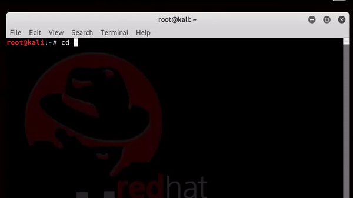

# Ejection
Ejection is a software to eject a user from the network with the Arpspoofing attack

[](https://www.python.org/)

## Installation

```
git clone https://github.com/THAL9000/ejection.git && cd ejection

```


## Use
Use the software with the followings instructions:

```
main.py --scan #to scan and attack in second time

main.py --ip_box ip_address --ip_attack ip_address  --mac_victim mac_address --time time_minutes

```

## demonstration video




